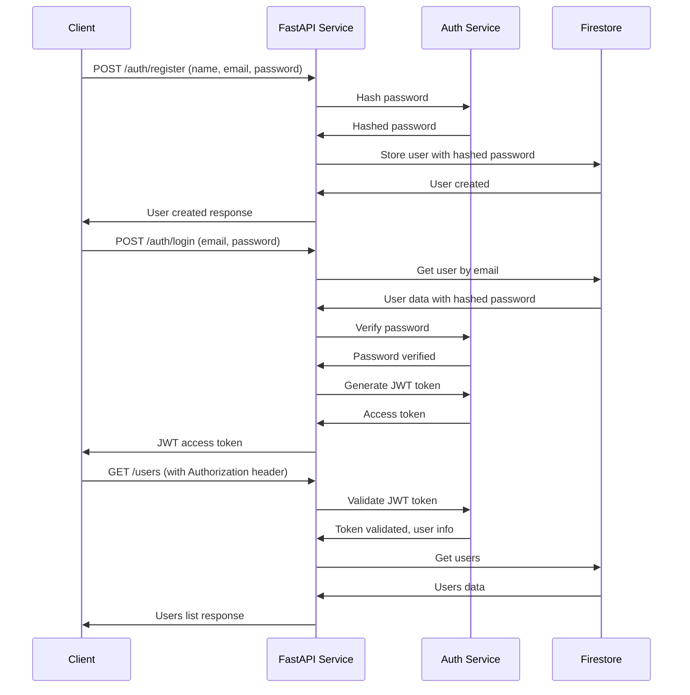
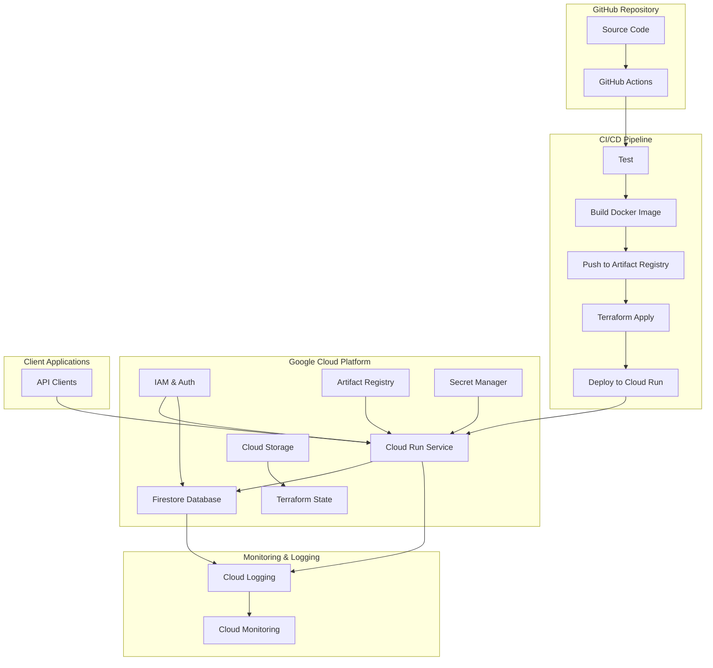

# FastAPI Application with Authentication, GCP Cloud Run, Firestore, Terraform IaC, and GitHub Actions CI/CD

This document outlines the architecture and implementation plan for a FastAPI application with Docker containerization, Firestore integration, JWT authentication, Terraform Infrastructure as Code, and GitHub Actions CI/CD pipeline.

## 1. Project Structure

```
simple-manip-survey/
├── .github/
│   └── workflows/
│       └── ci-cd.yml         # GitHub Actions workflow for CI/CD
├── app/
│   ├── __init__.py
│   ├── main.py               # FastAPI application entry point
│   ├── core/
│   │   ├── config.py         # Application configuration
│   │   ├── security.py       # Authentication and security utilities
│   │   └── exceptions.py     # Custom exception handlers
│   ├── models/
│   │   ├── user.py           # Pydantic models for user data
│   │   └── token.py          # Pydantic models for authentication tokens
│   ├── routers/
│   │   ├── users.py          # API routes for user operations
│   │   └── auth.py           # API routes for authentication
│   └── services/
│       ├── firestore.py      # Firestore database service
│       └── auth.py           # Authentication service
├── iac/
│   ├── key_information.txt   # (existing) GCP project information
│   ├── service-account-key.json  # (existing) GCP service account key
│   ├── gcloud_setup.py       # (existing) GCP setup script
│   ├── github_test.py        # (existing) GitHub integration test
│   └── terraform/
│       ├── main.tf           # Main Terraform configuration
│       ├── variables.tf      # Terraform variables
│       ├── outputs.tf        # Terraform outputs
│       └── backend.tf        # Terraform backend configuration
├── tests/
│   ├── __init__.py
│   ├── conftest.py           # Test configuration
│   ├── test_users.py         # Tests for user API
│   └── test_auth.py          # Tests for authentication
├── docs/
│   └── architecture.md       # This architecture document
├── .gitignore                # Git ignore file
├── Dockerfile                # Docker configuration for the application
├── docker-compose.yml        # Docker Compose for local development
├── requirements.txt          # Python dependencies
└── README.md                 # Project documentation
```

## 2. FastAPI Application Components

### 2.1 Core Application (`app/main.py`)
- FastAPI application setup with CORS middleware
- Health check endpoint
- API router registration
- Firestore initialization
- Authentication middleware
- Logging configuration

### 2.2 Authentication Components
- `app/core/security.py`: JWT token generation and validation
- `app/models/token.py`: Token schemas
- `app/routers/auth.py`: Authentication endpoints
- `app/services/auth.py`: Authentication service

### 2.3 Data Models (`app/models/user.py`)
- Pydantic models for user data:
  - `UserCreate`: Schema for creating a new user (name, email, password)
  - `UserResponse`: Schema for user responses (id, name, email)
  - `UserUpdate`: Schema for updating user data (optional name, email, password)
  - `UserInDB`: Schema for user in database (includes hashed password)

### 2.4 API Routes (`app/routers/users.py`)
- CRUD operations for users:
  - `GET /users`: List all users (protected)
  - `GET /users/{user_id}`: Get a specific user (protected)
  - `POST /users`: Create a new user
  - `PUT /users/{user_id}`: Update a user (protected)
  - `DELETE /users/{user_id}`: Delete a user (protected)

### 2.5 Authentication Routes (`app/routers/auth.py`)
- `POST /auth/register`: Register a new user
- `POST /auth/login`: Login and get access token
- `GET /auth/me`: Get current user information

### 2.6 Firestore Service (`app/services/firestore.py`)
- Firestore client initialization
- Collection management
- CRUD operations for user documents
- Error handling for database operations

## 3. Docker Configuration

### 3.1 Dockerfile
- Multi-stage build for optimized container size
- Python 3.9+ base image
- Proper dependency installation
- Non-root user for security
- Health check configuration

### 3.2 Docker Compose (for local development)
- FastAPI service configuration
- Firestore emulator for local testing
- Volume mapping for code changes
- Environment variable configuration

## 4. Terraform Infrastructure as Code

### 4.1 Main Configuration (`iac/terraform/main.tf`)
- Google provider configuration
- Cloud Run service
- Firestore database
- IAM permissions
- Networking configuration
- Secret Manager for JWT secret key

### 4.2 Variables (`iac/terraform/variables.tf`)
- Project ID
- Region
- Service name
- Container image
- Environment variables
- JWT configuration

### 4.3 Outputs (`iac/terraform/outputs.tf`)
- Cloud Run service URL
- Firestore database details

### 4.4 Backend Configuration (`iac/terraform/backend.tf`)
- GCS bucket for Terraform state
- State locking mechanism

## 5. CI/CD Pipeline with GitHub Actions

### 5.1 Workflow Configuration (`.github/workflows/ci-cd.yml`)
- Trigger on push to main branch and pull requests
- Environment setup
- Testing stage (including authentication tests)
- Docker build and push to Artifact Registry
- Terraform validation and planning
- Infrastructure deployment
- Application deployment to Cloud Run
- Post-deployment verification

### 5.2 Pipeline Stages
1. **Setup**: Configure GCP authentication and environment
2. **Test**: Run unit and integration tests (including auth tests)
3. **Build**: Build and tag Docker image
4. **Push**: Push image to Artifact Registry
5. **Plan**: Run Terraform plan to validate changes
6. **Apply**: Apply Terraform changes to provision/update infrastructure
7. **Deploy**: Deploy application to Cloud Run
8. **Verify**: Run health checks and auth tests to verify deployment

## 6. Testing Strategy

### 6.1 Unit Tests
- Test API endpoints with mocked Firestore service
- Test data models and validation
- Test error handling
- Test authentication and token generation/validation

### 6.2 Integration Tests
- Test API endpoints with Firestore emulator
- Test database operations
- Test authentication flows

### 6.3 End-to-End Tests
- Test complete user flows including authentication
- Verify deployment in CI/CD pipeline

## 7. Monitoring and Logging

### 7.1 Application Logging
- Structured JSON logging
- Log levels (DEBUG, INFO, WARNING, ERROR)
- Request/response logging middleware

### 7.2 Cloud Run Monitoring
- CPU and memory utilization
- Request count and latency
- Error rate

### 7.3 Firestore Monitoring
- Read/write operations
- Storage usage
- Query performance

## 8. Implementation Plan

### Phase 1: Local Development Setup
1. Create FastAPI application structure
2. Implement user models and API routes
3. Set up Firestore service with local emulator
4. Create Dockerfile and docker-compose.yml
5. Implement basic tests

### Phase 2: Authentication Implementation
1. Add JWT-based authentication components
2. Implement user registration and login endpoints
3. Add password hashing and verification
4. Implement token generation and validation
5. Add authentication middleware to protect routes
6. Update user model to include password field
7. Add tests for authentication flows

### Phase 3: Infrastructure as Code
1. Create Terraform configuration for Cloud Run
2. Configure Firestore database in Terraform
3. Set up IAM permissions and networking
4. Configure Secret Manager for JWT secret
5. Configure Terraform backend with GCS bucket

### Phase 4: CI/CD Pipeline
1. Create GitHub Actions workflow
2. Configure GCP authentication in GitHub
3. Set up testing, building, and deployment stages
4. Implement verification steps including auth tests

### Phase 5: Deployment and Testing
1. Push code to GitHub repository
2. Verify CI/CD pipeline execution
3. Test deployed application including authentication
4. Document API endpoints and usage

## 9. Authentication Flow Diagram



## 10. Architecture Diagram



## 11. Security Considerations

1. **Password Security**: Secure password hashing with bcrypt
2. **JWT Security**: Proper token expiration and signature verification
3. **Service Account Permissions**: Least privilege principle for service accounts
4. **Secrets Management**: Secure handling of JWT secret and service account keys
5. **Network Security**: Private Cloud Run services with IAM-based access
6. **Container Security**: Non-root user in Docker, minimal base image
7. **Firestore Security Rules**: Proper rules for data access based on authentication